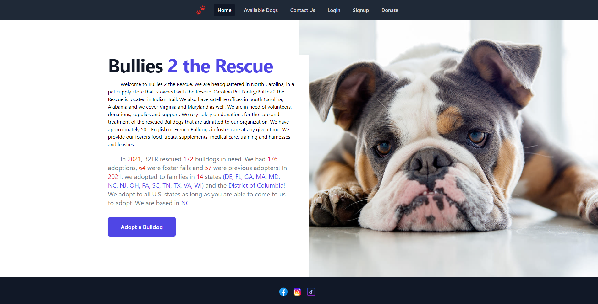

# Bullies To The Rescue

## Table of Content
* [Description](#description)
* [Visuals](#visuals)
* [Links](#links)
* [Technology](#technology)
* [Contributing](#contributing)
* [Support](#support)
* [License](#license)

## Description
Animals are always looking for their forever home! We would like to make a website for an adoption company called Bullies to the Rescue. This website will take in applications, show dogs that are available for adoption and take in donations to the non profit organization.

## Visuals

## Links
GitHub: https://github.com/SupernalDeity/bullies-to-the-rescue

Live Link: https://gruesome-witch-05502.herokuapp.com/

## Technology
JavaScript
HTML
React.js
Apollo
MongoDB/Mongoose
Node.js
Express.js
Tailwind CSS
Git and GitHub

## Contributing
### Heather Cruz
 
https://github.com/hcruz77
### Syd Wiegman

https://github.com/Sydwig
### Jen Arnold

https://github.com/Cannaestia
### Ted Shishkovskiy

https://github.com/TheodoreShishkovskiy
### Anthony Perez

https://github.com/SupernalDeity

## Suppport
Send support ticket to:
* HeatherCruz@gmail.com
* sjwiegman@gmail.com
* Cannaestia@gmail.com
* tmshishkovskiy@gmail.com
* perezant121@gmail.com

## License 
MIT License

Copyright (c) [2022] [bullies-to-the-rescue]

Permission is hereby granted, free of charge, to any person obtaining a copy of this software and associated documentation files (the "Software"), to deal in the Software without restriction, including without limitation the rights to use, copy, modify, merge, publish, distribute, sublicense, and/or sell copies of the Software, and to permit persons to whom the Software is furnished to do so, subject to the following conditions:

The above copyright notice and this permission notice shall be included in all copies or substantial portions of the Software.

THE SOFTWARE IS PROVIDED "AS IS", WITHOUT WARRANTY OF ANY KIND, EXPRESS OR IMPLIED, INCLUDING BUT NOT LIMITED TO THE WARRANTIES OF MERCHANTABILITY, FITNESS FOR A PARTICULAR PURPOSE AND NONINFRINGEMENT. IN NO EVENT SHALL THE AUTHORS OR COPYRIGHT HOLDERS BE LIABLE FOR ANY CLAIM, DAMAGES OR OTHER LIABILITY, WHETHER IN AN ACTION OF CONTRACT, TORT OR OTHERWISE, ARISING FROM, OUT OF OR IN CONNECTION WITH THE SOFTWARE OR THE USE OR OTHER DEALINGS IN THE SOFTWARE.